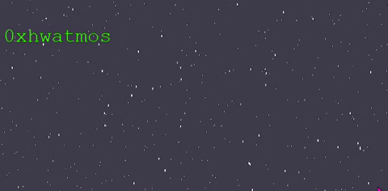

# Starfield Animation in PixiJS

This is a simple parallax scrolling starfield animation written in PixiJS. The animation contains three layers of stars and is interactive: clicking causes a zoom in/out effect.

To view this in action, you can visit my homepage at https://kamilluto.com/starfield/.

GIF Preview:

